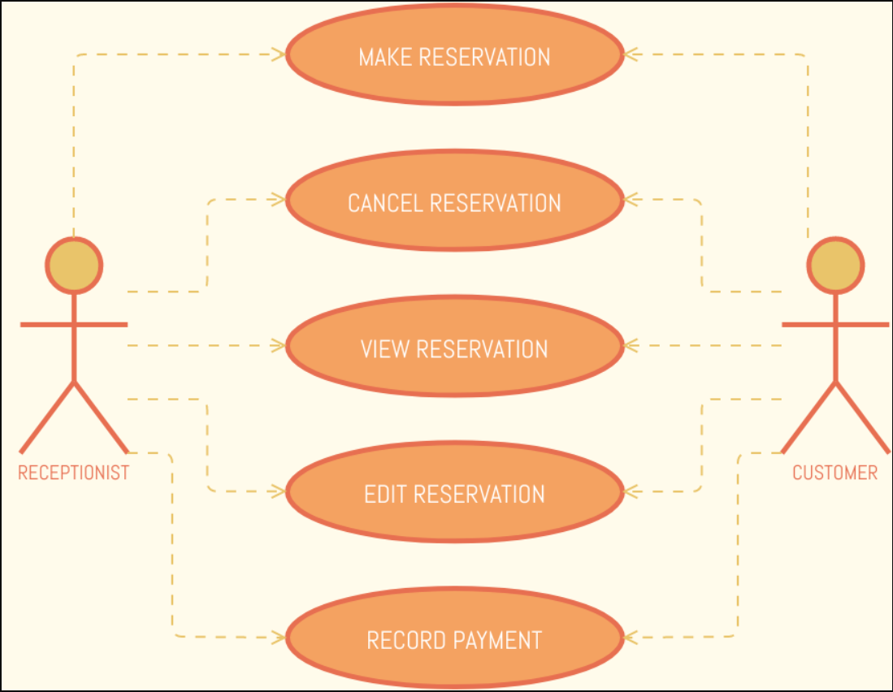

# itelective3-web

# Verdon Parc Condo
## WordPress

    

### Hotel Reservation System
A hotel reservation system is a oftware used in the hotel industry to control room availability, prices, and bookings is known as a hotel reservation system. It may be a part of the hotel's property management system (PMS), often known as a central reservations system (CRS), or it may be separate software that is connected to the PMS.

 
 

